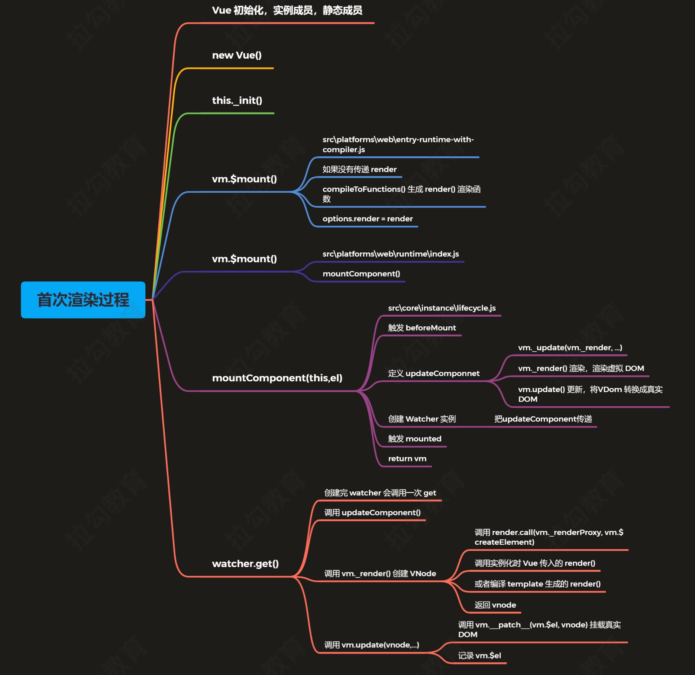

vue源码：https://github.com/Dream-Life/fed-e-task-code/tree/master/part-03/module-02/03-02-codes/code/vue

# vue源码解析
1. rollup 
    - -w 监听
    - -c 配置文件
    - --environment 环境变量
    - --sourcemap
2. Vue 初始化
    - 初始化 Vue 的静态方法：src/core/global-api/index.js
    - 定义 Vue 的构造函数和初始化 Vue 的实例成员：src/core/instance/index.js

3. Vue 首次渲染
   - 

4. watcher执行顺序：计算watcher，$watcher，渲染watcher
5. Vue 初始化:
   - 声明_init()
   - $children/$parent/$root/$refs     initLifecycle()
   - vm 的事件监听初始化, 父组件绑定在当前组件上的事件 initEvents()
   - $slots/$scopedSlots/_c/$createElement/$attrs/$listeners.    initRender()
   - beforeCreate()
   - initInjections()
   - initState() observe数据 data，compute， props，$watch...
   - initProvide()
   - created()
   - $on/$once/$off/$emit
   -  _update/$forceUpdate/$destroy
   - $nextTick/_render
   - initGlobalAPI()静态方法
   - $mount --- mountComponent     beforeMount ，声明更新patch，声明watcher和beforeUpdate，mounted
6. observe绑定数据，watcher在编译时声明与observe的get关联，dep收集watcher